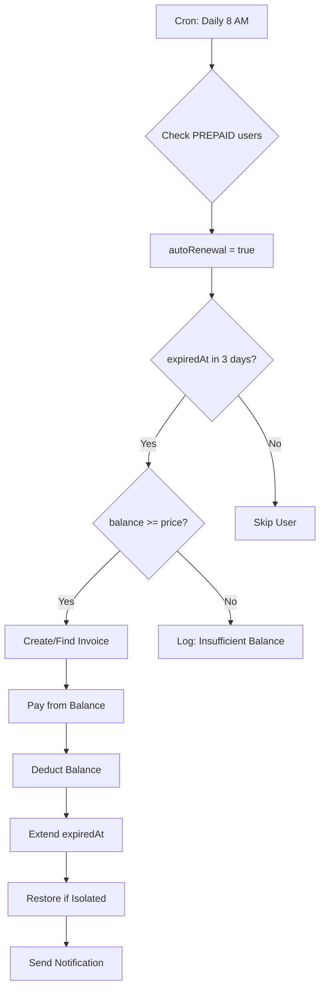

# Balance & Auto-Renewal System Documentation

**Version**: 2.11.6  
**Date**: March 27, 2026  
**Status**: ✅ Implemented

---

## 📋 Overview

Sistem Balance (Saldo Deposit) dan Auto-Renewal adalah fitur enhancement untuk tipe pelanggan **PREPAID** yang memungkinkan:

1. **Balance/Deposit**: Pelanggan bisa top-up saldo untuk perpanjangan otomatis
2. **Auto-Renewal**: Perpanjangan otomatis dari saldo saat mendekati expired
3. **Auto-Payment**: Invoice otomatis dibayar dari saldo tanpa intervensi manual

---

## 🏗️ Architecture

### Database Schema

```prisma
model pppoeUser {
  // ... existing fields
  
  balance              Int        @default(0)     // Saldo deposit (in cents/smallest currency unit)
  autoRenewal          Boolean    @default(false) // Enable auto-renewal from balance
  
  // ... other fields
}
```

### API Endpoints

#### 1. Top-Up Balance
```http
POST /api/admin/pppoe/users/:id/deposit
Content-Type: application/json

{
  "amount": 100000,           // Amount in smallest currency unit (e.g., cents)
  "paymentMethod": "CASH",    // CASH, TRANSFER, etc.
  "note": "Top up via admin"  // Optional note
}
```

**Response:**
```json
{
  "message": "Top up berhasil",
  "data": {
    "username": "user123",
    "previousBalance": 50000,
    "amount": 100000,
    "newBalance": 150000
  }
}
```

#### 2. Get Balance History
```http
GET /api/admin/pppoe/users/:id/deposit
```

**Response:**
```json
{
  "user": {
    "id": "user-123",
    "username": "user123",
    "balance": 150000
  },
  "transactions": [
    {
      "id": "tx-001",
      "amount": 100000,
      "type": "DEPOSIT",
      "category": "DEPOSIT",
      "description": "Top up via admin",
      "paymentMethod": "CASH",
      "status": "SUCCESS",
      "createdAt": "2025-12-23T10:00:00Z"
    }
  ]
}
```

---

## ⚙️ Auto-Renewal Logic

### Workflow



### Cron Job Configuration

**File**: `src/lib/cron/config.ts`

```typescript
{
  type: 'auto_renewal',
  name: 'Auto Renewal (Prepaid)',
  description: 'Automatically renew prepaid users from balance if autoRenewal enabled',
  schedule: '0 8 * * *',
  scheduleLabel: 'Daily at 8 AM',
  handler: async () => {
    const { processAutoRenewal } = await import('./auto-renewal');
    return processAutoRenewal();
  },
  enabled: true,
}
```

### Implementation Details

**File**: `src/lib/cron/auto-renewal.ts`

**Key Functions:**

1. **processAutoRenewal()** - Main cron handler
   - Find users with `autoRenewal = true` and `expiredAt` within 3 days
   - Check if balance sufficient
   - Create or find pending invoice
   - Call `payInvoiceFromBalance()`

2. **payInvoiceFromBalance()** - Payment processor
   - Deduct balance from user
   - Mark invoice as PAID
   - Extend `expiredAt` by validity period
   - Create transaction record
   - Restore user in RADIUS if isolated
   - Send WhatsApp notification

3. **restoreUserInRADIUS()** - RADIUS restoration
   - Remove user from 'isolir' group
   - Remove Reply-Message attribute
   - User can connect again

---

## 📊 Usage Examples

### Example 1: Admin Top-Up Balance

```bash
# Admin top-up balance for user
curl -X POST http://localhost:3000/api/admin/pppoe/users/abc123/deposit \
  -H "Content-Type: application/json" \
  -d '{
    "amount": 200000,
    "paymentMethod": "TRANSFER",
    "note": "Top up via BCA"
  }'
```

### Example 2: Enable Auto-Renewal

```typescript
// Update user to enable auto-renewal
await prisma.pppoeUser.update({
  where: { id: 'user-123' },
  data: {
    autoRenewal: true,
    balance: 100000  // Ensure sufficient balance
  }
})
```

### Example 3: Check Auto-Renewal Eligibility

```sql
-- Query users eligible for auto-renewal
SELECT 
  username,
  balance,
  autoRenewal,
  expiredAt,
  DATEDIFF(expiredAt, NOW()) as days_to_expiry,
  p.price as package_price
FROM pppoe_users pu
JOIN pppoe_profiles p ON p.id = pu.profileId
WHERE 
  pu.subscriptionType = 'PREPAID'
  AND pu.autoRenewal = TRUE
  AND pu.expiredAt BETWEEN NOW() AND DATE_ADD(NOW(), INTERVAL 3 DAY)
  AND pu.balance >= p.price
```

---

## 🧪 Testing Guide

### Test Case 1: Successful Auto-Renewal

**Prerequisites:**
- User type: PREPAID
- autoRenewal: true
- balance: >= package price
- expiredAt: in 2 days

**Steps:**
1. Set user's expiredAt to 2 days from now
2. Set balance to package price or more
3. Wait for cron to run (or trigger manually)
4. Verify invoice created and paid
5. Verify balance deducted
6. Verify expiredAt extended

**Expected Result:**
```
✅ Invoice auto-created
✅ Invoice status = PAID
✅ Payment method = BALANCE
✅ Balance reduced by package price
✅ expiredAt = old expiredAt + validity period
✅ User status = active (if was isolated)
✅ WhatsApp notification sent
```

### Test Case 2: Insufficient Balance

**Prerequisites:**
- User type: PREPAID
- autoRenewal: true
- balance: < package price
- expiredAt: in 2 days

**Steps:**
1. Set balance less than package price
2. Wait for cron to run
3. Check logs

**Expected Result:**
```
❌ Invoice created but not paid
⚠️ Log: "Insufficient balance (50000 < 100000)"
📧 Manual payment required
```

### Test Case 3: Manual Payment After Auto-Fail

**Prerequisites:**
- Previous auto-renewal failed due to insufficient balance
- Invoice status: PENDING

**Steps:**
1. Admin top-up balance
2. User pays invoice manually OR
3. Wait for next cron run

**Expected Result:**
```
✅ Next cron run will auto-pay the pending invoice
✅ expiredAt extended
✅ User restored
```

---

## 🚀 Deployment

### 1. Database Migration

Schema already includes `balance` and `autoRenewal` fields. No migration needed if already on v2.7.5+.

### 2. Code Deployment

```bash
# Pull latest code
git pull origin main

# Install dependencies (if needed)
npm install

# Build application
npm run build

# Restart PM2
pm2 restart all
```

### 3. Verify Cron Job

```bash
# Check if auto-renewal cron is registered
curl http://localhost:3000/api/admin/cron | jq '.jobs[] | select(.type=="auto_renewal")'

# Expected output:
{
  "type": "auto_renewal",
  "name": "Auto Renewal (Prepaid)",
  "enabled": true,
  "schedule": "0 8 * * *",
  "lastRun": null
}
```

### 4. Test Cron Manually (Optional)

```typescript
// In Node.js console or API route
import { processAutoRenewal } from '@/lib/cron/auto-renewal'

const result = await processAutoRenewal()
console.log(result)
// { processed: 5, success: 3, failed: 2 }
```

---

## 🔍 Monitoring

### Key Metrics

1. **Auto-Renewal Success Rate**
   ```sql
   SELECT 
     COUNT(*) as total_attempts,
     SUM(CASE WHEN status = 'success' THEN 1 ELSE 0 END) as successful,
     SUM(CASE WHEN status = 'error' THEN 1 ELSE 0 END) as failed
   FROM cron_history
   WHERE job_type = 'auto_renewal'
     AND started_at >= DATE_SUB(NOW(), INTERVAL 7 DAY)
   ```

2. **Balance Usage**
   ```sql
   SELECT 
     COUNT(*) as users_with_autorenewal,
     AVG(balance) as avg_balance,
     MIN(balance) as min_balance,
     MAX(balance) as max_balance
   FROM pppoe_users
   WHERE autoRenewal = TRUE
   ```

3. **Upcoming Renewals**
   ```sql
   SELECT 
     COUNT(*) as upcoming_renewals,
     SUM(CASE WHEN balance >= p.price THEN 1 ELSE 0 END) as can_autorenew,
     SUM(CASE WHEN balance < p.price THEN 1 ELSE 0 END) as insufficient_balance
   FROM pppoe_users pu
   JOIN pppoe_profiles p ON p.id = pu.profileId
   WHERE 
     pu.subscriptionType = 'PREPAID'
     AND pu.autoRenewal = TRUE
     AND pu.expiredAt BETWEEN NOW() AND DATE_ADD(NOW(), INTERVAL 3 DAY)
   ```

### Logs

```bash
# Check auto-renewal logs
pm2 logs | grep "Auto-Renewal"

# Example output:
[Auto-Renewal] Starting auto-renewal process...
[Auto-Renewal] Found 5 users eligible for auto-renewal
[Auto-Renewal] Created invoice INV-202512-ABC12345 for user123
[Auto-Payment] ✅ User user123 - Paid 100000 from balance. New balance: 50000
[Auto-Renewal] Completed. Success: 3, Failed: 2
```

---

## ⚠️ Important Notes

1. **Currency**: Amount harus dalam satuan terkecil (cents/sen). Contoh: Rp 100.000 = 100000 (bukan 100)

2. **Balance Safety**: Tidak ada negative balance. Jika balance < price, auto-renewal akan skip.

3. **Notification**: Auto-renewal akan mengirim notifikasi WhatsApp menggunakan template `payment_approved`.

4. **RADIUS Sync**: Jika user dalam status isolated, auto-renewal akan otomatis restore user di RADIUS.

5. **Transaction History**: Setiap top-up dan auto-payment dicatat di tabel `transactions` dengan category `DEPOSIT` atau `PAYMENT`.

6. **Cron Schedule**: Default jam 8 pagi. Bisa diubah di `src/lib/cron/config.ts`.

7. **Grace Period**: Auto-renewal check 3 hari sebelum expired. Ubah di `auto-renewal.ts` jika perlu.

---

## 🐛 Troubleshooting

### Issue: Auto-Renewal Not Working

**Checklist:**
- [ ] User `subscriptionType` = 'PREPAID'?
- [ ] User `autoRenewal` = true?
- [ ] User `expiredAt` within 3 days?
- [ ] User `balance` >= package price?
- [ ] Cron job enabled in config?
- [ ] PM2 running and healthy?

**Debug:**
```bash
# Check cron status
curl http://localhost:3000/api/admin/cron

# Check user configuration
SELECT username, subscriptionType, autoRenewal, balance, expiredAt 
FROM pppoe_users 
WHERE id = 'user-id';

# Check cron history
SELECT * FROM cron_history 
WHERE job_type = 'auto_renewal' 
ORDER BY started_at DESC 
LIMIT 10;
```

### Issue: Balance Not Deducted

**Possible Causes:**
1. Transaction failed midway
2. Database deadlock
3. Insufficient balance (edge case: concurrent payment)

**Solution:**
- Check `transactions` table for failed records
- Check `invoices` table - if status = PENDING, retry auto-renewal
- Check PM2 logs for detailed error

---

## 📚 References

- [PREPAID_POSTPAID_IMPLEMENTATION.md](./PREPAID_POSTPAID_IMPLEMENTATION.md) - Main billing system docs
- [ROADMAP_BILLING_FIX.md](../ROADMAP_BILLING_FIX.md) - Complete roadmap
- [Cron System Documentation](./CRON-SYSTEM.md) - Cron job configuration

---

**Last Updated**: December 23, 2025  
**Implemented By**: GitHub Copilot + AI Assistant  
**Status**: ✅ Production Ready
